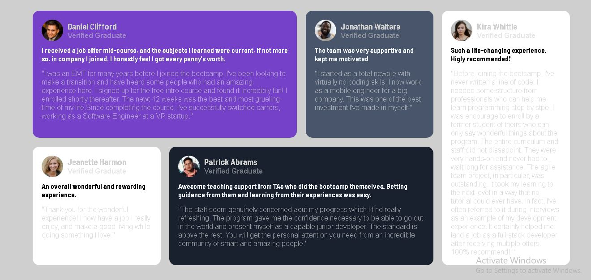

# Frontend Mentor - Testimonials grid section solution

This is a solution to the [Testimonials grid section challenge on Frontend Mentor](https://www.frontendmentor.io/challenges/testimonials-grid-section-Nnw6J7Un7). Frontend Mentor challenges help you improve your coding skills by building realistic projects. 

## Table of contents

- [Overview](#overview)
  - [The challenge](#the-challenge)
  - [Screenshot](#screenshot)
  - [Links](#links)
  - [Built with](#built-with)
  - [What I learned](#what-i-learned)
  - [Useful resources](#useful-resources)
- [Author](#author)

**Note: Delete this note and update the table of contents based on what sections you keep.**

## Overview

### The challenge

Users should be able to:

- View the optimal layout for the site depending on their device's screen size

### Screenshot



### Links

- Solution URL:(https://github.com/Marvel123g/testimonial-grid.git))
- Live Site URL: [Add live site URL here](https://your-live-site-url.com)

### Built with

- Semantic HTML5 markup
- CSS custom properties
- CSS Grid

### What I learned

```css
.container{
    display: grid;
    grid-auto-columns:1fr;
    grid-auto-rows: minmax(150px auto);
    grid-template-areas:
    'card1 card1 card2 card3'
    'card4 card5 card5 card3';
}

### Useful resources

- [ChatGPT](https://www.example.com) - This helped me for the grid template areas.

## Author

- Website - [Marvelous](https://www.your-site.com)
- Frontend Mentor - [@Marvel123g](https://www.frontendmentor.io/profile/Marvel123g)
- Instagram - [@ma.rvellous971]
